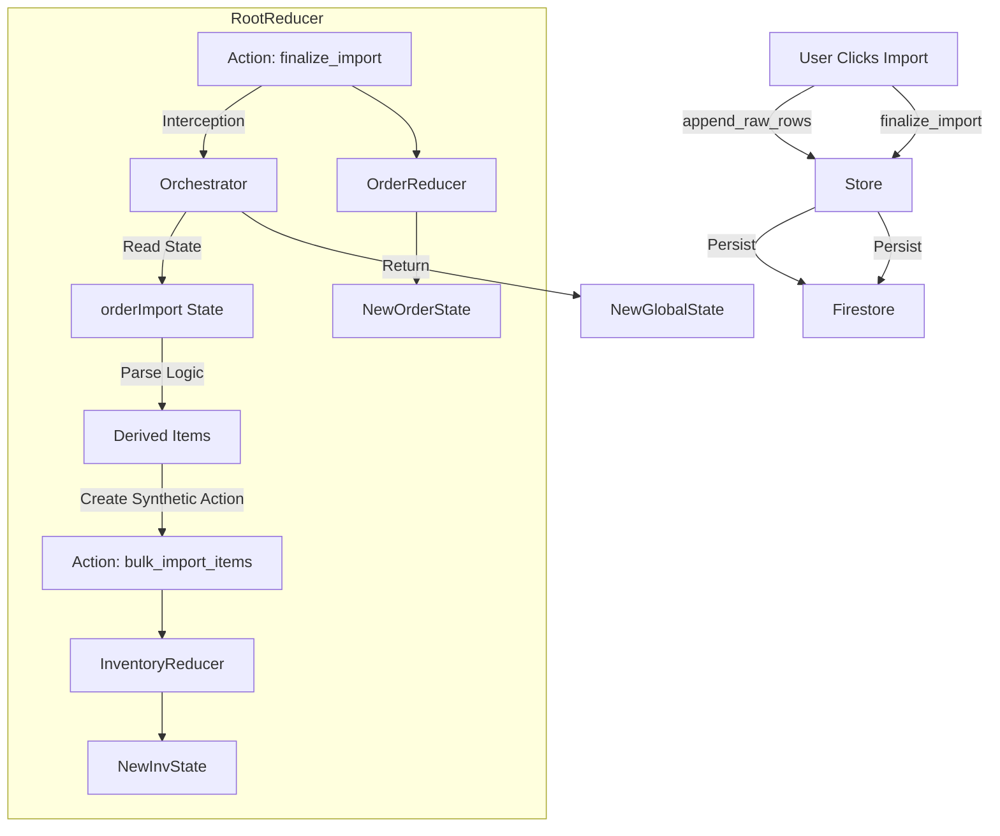

# Event Sourcing Design & Refactor

## Core Philosophy: "Facts vs. Intent" + "Root Action Composition"

The system is built on an append-only log of immutable actions ("Broadcast").
To ensure robustness and fixability, we adopt a **Red/Green** classification for actions, enforced by a **Root Reducer Composition** pattern.

### The Problem
*   **Green Actions** (Facts/Intent): Safe to persist. E.g., `append_raw_rows` (Raw CSV), `finalize_import` (User clicked "Go").
*   **Red Actions** (Derived): Unsafe to persist. E.g., `bulk_import_items` (contains parsed objects).
*   **Challenge**: We need the `inventory` slice to update based on `order-import` data, but `inventory` logic shouldn't verify parsing, and `order-import` logic shouldn't know about inventory structure. We want separated concerns but atomic execution.

### The Solution: Root Reducer Composition

Instead of dispatching "Red" actions to the store (where they would be broadcast), we handle "Green" actions in the **Root Reducer** to orchestrate cross-slice logic **internally**.

1.  **Ingest Raw Data (Green)**:
    -   `append_raw_rows`: Stores raw CSV chunks in `orderImport.rows`.
    -   Persisted.

2.  **Trigger Import (Green)**:
    -   `finalize_import`: Carries User Intent (e.g., "Use Column 5 for HS Code").
    -   Persisted.

3.  **Root Reducer Execution**:
    -   The Root Reducer intercepts `finalize_import`.
    -   **Step A**: It reads the *current* `orderImport.rows` state.
    -   **Step B**: It executes the logic to parse those rows (using current code).
    -   **Step C**: It constructs a *synthetic, internal-only* action: `bulk_import_items` (containing the parsed items).
    -   **Step D**: It calls the `inventory` reducer with this synthetic action.
    -   **Step E**: It calls the `orderImport` reducer with the original `finalize_import` action (to clear the buffer).
    -   **Step F**: It returns the combined new state.

### Safety Mechanism: The "Poison Pill"
To guarantee that `bulk_import_items` is **never** accidentally broadcast (e.g., if a developer dispatches it manually), we add a non-serializable field to its payload, or a specific `_ephemeral: true` flag that the Firestore middleware checks and rejects.

## Architecture Data Flow

## Implementation Plan

1.  **Middleware Safety**:
    -   Update `redux-firestore.ts` to reject any action containing `_ephemeral: true`.

2.  **Refactor `rootReducer`**:
    -   Implement the interception logic for `finalize_import`.
    -   Import parsing logic (currently "reparse" or similar) to be usable here.

3.  **Refactor `order-import-slice`**:
    -   Remove `bulk_import_items` dispatch from thunks/components.
    -   Ensure `finalize_import` only clears state.

4.  **Refactor `shopify-import-slice`**:
    -   Apply same pattern: `finalize_shopify_import`.

## Legacy Compatibility
-   Existing `update_item` actions (Legacy Red/Yellow) in Firestore remain as the baseline.
-   Replay logic handles them naturally via the standard reducer.
-   New imports use the new Green path.
