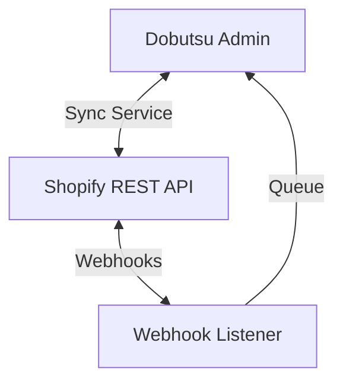

# Shopify Integration - Design Document

## Overview

This document outlines the design for integrating the Dobutsu Stationery inventory management system with Shopify. The goal is to establish a robust, two-way synchronization of inventory levels and order data.

## Core Design Principles

1.  **Clear Source of Truth**:
    *   **Admin System** is the master for **INVENTORY QUANTITIES**.
    *   **Shopify** is the master for **PRODUCT METADATA** (images, descriptions) and **ORDERS**.
2.  **Simplicity First**: Implement the minimum viable synchronization (Inventory Levels) first.
3.  **Fail-Safe**: In case of conflict or failure, the system should default to "safe" states (e.g., preventing overselling) and alert humans.

## Data Mapping

We use a composite key strategy to map internal items to Shopify Variants.

| Dobutsu Field | Shopify Field | Notes |
| :--- | :--- | :--- |
| `janCode` + `subtype` | `sku` | **CRITICAL**: The Shopify Variant SKU must match our `janCode-subtype` format exactly. |
| `qty` | `inventory_quantity` | The primary sync target. |
| `description` | `title` | Managed in Shopify, imported for reference. |

## Architecture

### System Components



1.  **Sync Service**: Handles outgoing updates (Admin -> Shopify). Triggered by inventory changes in Admin.
2.  **Webhook Listener**: Handles incoming events (Shopify -> Admin). securely verifies HMAC signatures.
3.  **Shopify API**: We use the **REST Admin API** for its simplicity and clear rate limiting (2 req/s).

## Implementation Phases

### Phase 1: MVP (Inventory Sync)
*Goal: Prevent overselling by keeping Shopify inventory up to date.*

1.  **Credentials**: Configure `SHOPIFY_ACCESS_TOKEN` and `SHOPIFY_STORE_URL`.
2.  **One-Way Sync**: When `qty` changes in Admin, call `inventory_levels/set.json` in Shopify.
3.  **Manual Pull**: "Sync from Shopify" button to pull current stock levels (for initial setup/Audit).

### Phase 2: Order Import (Automation)
*Goal: Automatically track shipments.*

1.  **Webhooks**: Listen for `orders/create`.
2.  **Processing**: When an order arrives:
    *   Match line items by SKU to our `Items`.
    *   Create an internal "Order" record.
    *   Deduct `shipped` quantities (if applicable) or reserve stock.

### Phase 3: Future/Advanced
*   **Product Creation**: Creating new items in Admin pushes them to Shopify.
*   **Multi-Location**: Support multiple warehouses.
*   **Price Sync**: managing prices from Admin.

## Configuration & Security

### Environment Variables

Do **NOT** commit these to source control.

```bash
# Public (Client-side)
VITE_SHOPIFY_STORE_URL=your-store.myshopify.com
VITE_SHOPIFY_API_VERSION=2024-01

# Private (Server-side ONLY)
SHOPIFY_ACCESS_TOKEN=shpat_xxxxxxxxxxxxxxxx
SHOPIFY_WEBHOOK_SECRET=whsec_xxxxxxxxxxxxxxx
SHOPIFY_SYNC_ENABLED=true
```

### Security Checklist
- [ ] **HMAC Validation**: All webhooks must be verified against `SHOPIFY_WEBHOOK_SECRET`.
- [ ] **Least Privilege**: Custom App scopes should be limited to `read_products`, `write_inventory`, `read_orders`.
- [ ] **Rate Limiting**: The Sync Service must respect the 2 requests/second limit, implementing a queue or backoff if necessary.

## Operations

### Initial Setup (Bulk)
For the first run, use the **CSV Export** feature:
1.  Export Inventory as CSV.
2.  Format to [Shopify Product CSV](https://help.shopify.com/en/manual/products/import-export/using-csv).
3.  Upload to Shopify to create baseline products.
4.  Enable Admin Sync.

### Conflict Handling
Since we defined clear Sources of Truth:
*   **Inventory Conflict**: Admin overwrites Shopify.
*   **Product Info Conflict**: Shopify overwrites Admin (during import/refresh).
