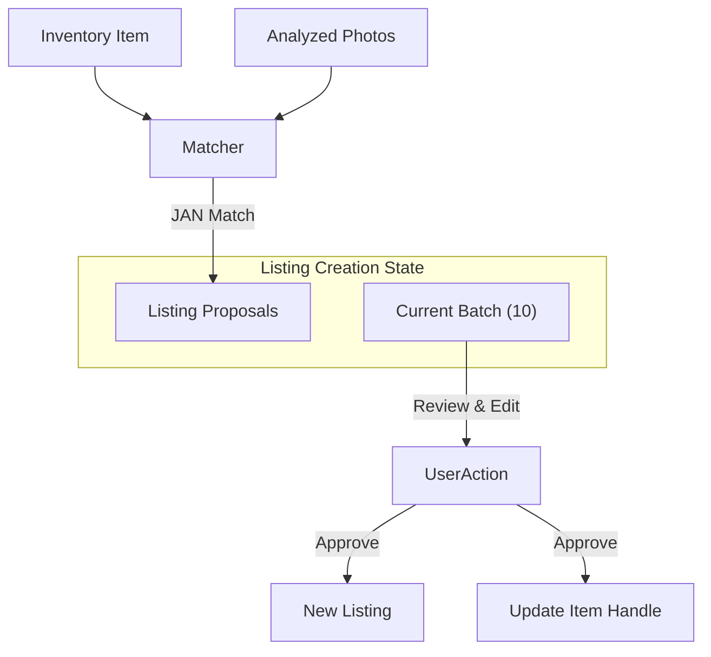

# Listings Creation Design Document

> **Status: Proposed**

## 1. Overview

This document outlines the design for the **Listings Creation** flow. This feature bridges the gap between **Imported Orders** (inventory items with quantities but no listing details) and **Shopify Listings** (public-facing product pages).

The goal is to provide a semi-automated, gamified workflow where users can review matched photos and inventory data to rapidly create high-quality product listings.

## 2. User Stories

1.  **As a User**, I want to see a "To-Do" list of items that have photos and inventory stock but no active listing, so I know what needs to be listed.
2.  **As a User**, I want the system to automatically propose a title, description, and category for these items based on the photos, so I don't have to write them from scratch.
3.  **As a User**, I want to review these proposals in small, manageable batches (e.g., 10 at a time) to avoid feeling overwhelmed.
4.  **As a User**, I want to easily assign "Subtypes" (e.g., Color, Style) if the item is a variant of a larger product family.
5.  **As a User**, I want a satisfying "done" moment (gamification) when I finish a batch, making the work feel rewarding.

## 3. User Experience (UX)

### 3.1 The "Listing Quest" (Gamification)

To prevent burnout, the infinite queue of unlisted items is broken down into **"Quests"** or **Batches**.

*   **Batch Size**: 10 Listings.
*   **Progress**: A distinct progress bar for the current batch (0/10).
*   **Completion**: When the 10th item is approved, a celebration animation plays (confetti, checkmark), and the user is returned to the dashboard with a "Batch Complete!" summary.

### 3.2 Review Interface

The review screen focuses on **one proposal at a time** (or a focused grid of the current batch).

**Layout:**
*   **Left**: Image Carousel (from matched Google Photos).
*   **Center**: Editable Listing Details.
    *   **Title**: Pre-filled by LLM.
    *   **Description**: Pre-filled by LLM (Rich Text).
    *   **Subtype/Variant**: Dropdown or Tags.
*   **Right**: Metadata & Actions.
    *   JAN Code, Current Stock, Estimated Price.
    *   **Actions**:
        *   ✅ **Approve** (Green): Publishes listing, moves to next.
        *   ✏️ **Edit**: Focus fields for manual entry.
        *   🗑️ **Discard/Skip**: Remover from key, or putting back in queue.

## 4. Technical Architecture

### 4.1 Data Flow



### 4.2 State Management (`listing-creation-slice.ts`)

We will introduce a new Redux slice `listing-creation` to manage the *ephemeral* state of proposals. This slice is fully reconstructible from the Event Log (Firestore Broadcast), ensuring sessions can be resumed.

```typescript
interface ListingProposal {
  // Source Data (Immutable after creation)
  janCode: string;
  inventoryItemIds: string[]; // Linked Inventory Items
  photoGroupIds: string[];    // Linked Photo Groups

  // Proposed Content (Editable)
  title: string;
  bodyHtml: string;
  productCategory: string;
  vendor: string;
  tags: string[];
  
  // Variant Config
  option1Name: string; // e.g. "Color"
  variants: {
    itemId: string;
    option1Value: string; // e.g. "Red"
  }[];
  
  status: 'draft' | 'approved' | 'skipped';
}

interface ListingCreationState {
  // All known proposals (key: janCode)
  proposals: Record<string, ListingProposal>;
  
  // The current active batch of work
  activeBatchJans: string[];
  
  // UI State (not persisted in broadcast, but derived or local)
  currentStepIndex: number; 
}
```

### 4.3 Persistence & Resumability

The "Session" is simply the aggregate state of all `listing-creation/*` actions broadcast to Firestore.

1.  **Resume**: When a user reloads the page, the `broadcast` listener replays all past actions. The `listing-creation` reducer rebuilds the `proposals` map and `activeBatchJans` list.
2.  **Concurrency**: Since actions are appended to a global log, multiple users *could* conflict if they edit the same JAN. To prevent this, the `BATCH_START` action "claims" JANs. The reducer will reject/ignore claims for JANs already in an active batch by another user (though strictly enforcing this requires a server-side rule or "Jailed" action check; for now, we rely on social coordination and UI warnings).

### 4.4 Detailed Redux Actions

Every user interaction corresponds to a specific Redux action. These actions are broadcast, ensuring zero data loss.

#### Session / Batch Management
*   **`INITIALIZE_SESSION`**
    *   *Trigger*: User visits `/listings/create`.
    *   *Payload*: None.
    *   *Effect*: Checks for existing active batch. If none, triggers `GENERATE_PROPOSALS`.
    
*   **`START_BATCH`**
    *   *Trigger*: User clicks "Start Batch" after proposals are generated.
    *   *Payload*: `{ janCodes: string[] }` (The verified list of 10 JANs).
    *   *Effect*: Sets `activeBatchJans`. effective "Lock" on these items.

#### Proposal Editing (The "Work")
*   **`UPDATE_PROPOSAL_FIELD`**
    *   *Trigger*: User types in Title, Body, Vendor, or Category.
    *   *Payload*: `{ janCode: string, field: keyof ListingProposal, value: any }`.
    *   *Effect*: Updates the draft content.

*   **`SET_VARIANT_OPTION_NAME`**
    *   *Trigger*: User changes "Option Name" (e.g. from "Color" to "Size").
    *   *Payload*: `{ janCode: string, name: string }`.
    *   *Effect*: Updates `option1Name`.

*   **`SET_VARIANT_VALUE`**
    *   *Trigger*: User changes the value for a specific SKU (e.g. "Blue").
    *   *Payload*: `{ janCode: string, itemId: string, value: string }`.
    *   *Effect*: Updates the specific variant entry.

*   **`ADD_TAG` / `REMOVE_TAG`**
    *   *Trigger*: User manages tags.
    *   *Payload*: `{ janCode: string, tag: string }`.

#### Review Decisions
*   **`APPROVE_PROPOSAL`**
    *   *Trigger*: User clicks "Approve".
    *   *Payload*: `{ janCode: string }`.
    *   *Effect*:
        1.  Marks proposal status as `approved`.
        2.  **Side Effect**: Dispatches `create_listing` (Listings Slice) with the final data.
        3.  **Side Effect**: Dispatches `update_item` (Inventory Slice) to link items to new handle.
        4.  Advances UI to next item.

*   **`SKIP_PROPOSAL`**
    *   *Trigger*: User clicks "Skip/Discard".
    *   *Payload*: `{ janCode: string, reason?: string }`.
    *   *Effect*: Marks status as `skipped`. Removes from queue.

#### Completion
*   **`COMPLETE_BATCH`**
    *   *Trigger*: All items in batch are resolved (Approved or Skipped).
    *   *Payload*: `{ batchId: string }`.
    *   *Effect*: Clears `activeBatchJans`, archives the proposals (or deletes them to keep state light), triggers "Celebration" UI.

## 5. Integration Plan

1.  **Photos Route**: Add a "Create Listings" button in the Photos "Done" state.
2.  **Dashboard**: Add a "Listings to Review" widget showing the count of potential proposals.
3.  **Navigation**: New route `/listings/create`.

## 6. Open Questions

*   **Pricing**: Where does the price come from?
    *   *Answer*: It should be in the Inventory Item from the **Order Import** step. If missing, the Review UI must enforce price entry.
*   **Handle Generation**: How do we generate the URL handle?
    *   *Answer*: Auto-slugify the Title (e.g., "Cute Cat Pen" -> `cute-cat-pen`). Check for collisions and append suffix if needed.
