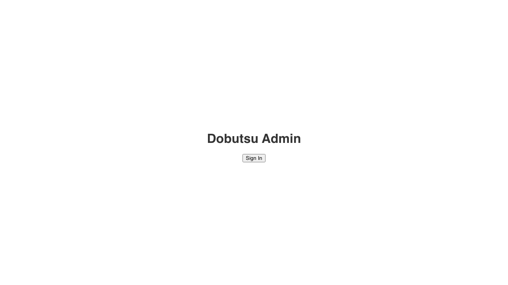
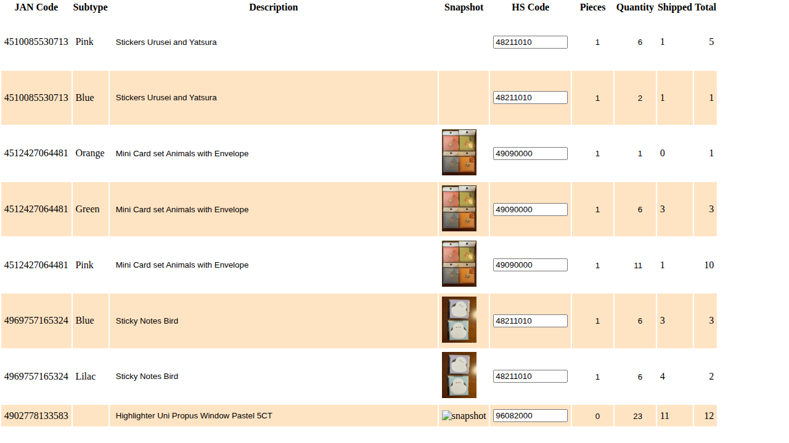
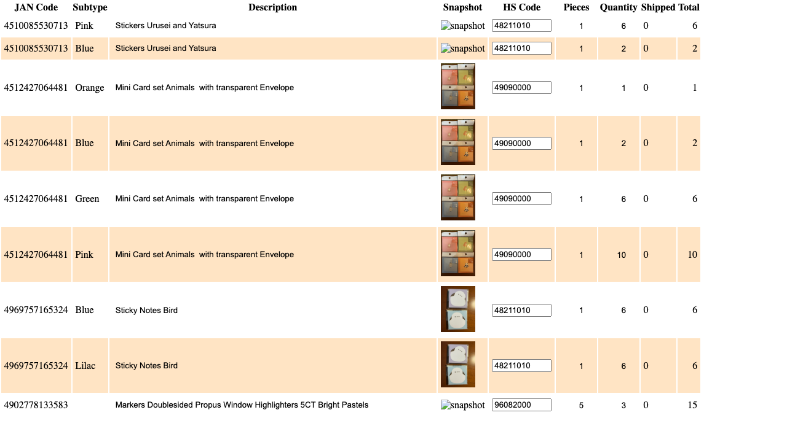

# Inventory Page Verification

**As an** admin user
**I want to** view the inventory
**So that** I can see current stock levels

### 1. Signed Out State

**Programmatic Verification:**
- [ ] Validated "Sign In" button is visible
- [ ] Verified no console errors (except expected auth init)

### 2. Signed In State

**Programmatic Verification:**
- [ ] Validated "Sign In" button is hidden
- [ ] Verified user is authenticated

### 3. Inventory Loaded

**Programmatic Verification:**
- [ ] Validated inventory table is visible
- [ ] Checked headers include "JAN Code" and "Quantity"
- [ ] Verified at least one row is displayed
- [ ] Validated sample row data structure
