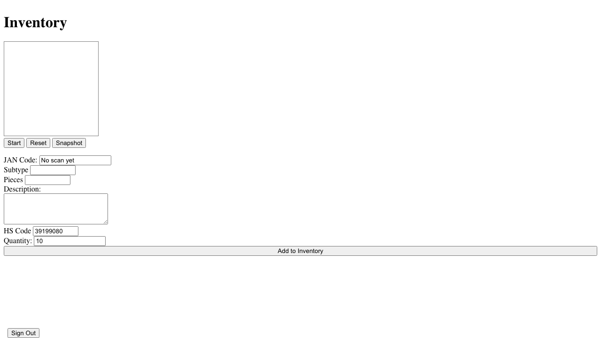
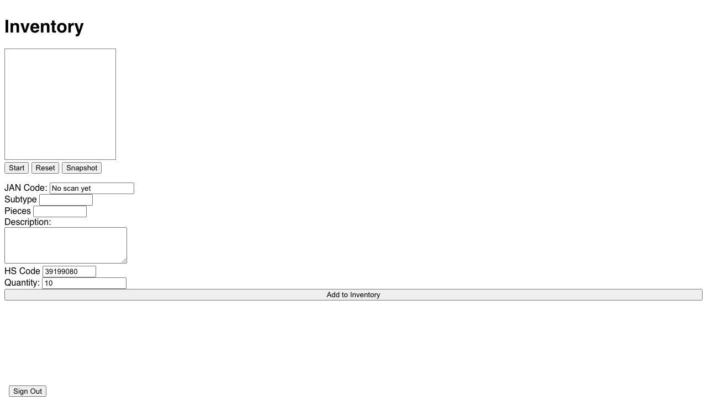

# Root Page (Inventory Entry) Verification

**As an** admin user
**I want to** enter new inventory items
**So that** I can add stock to the system

### 1. Signed Out State

**Programmatic Verification:**
- [ ] Validated "Sign In" button is visible
- [ ] Verified no console errors

### 2. Signed In State

**Programmatic Verification:**
- [ ] Validated "Sign In" button is hidden
- [ ] Verified user is authenticated

### 3. Form Loaded

**Programmatic Verification:**
- [ ] Validated inventory entry form is visible
- [ ] Checked for "JAN Code" input field
