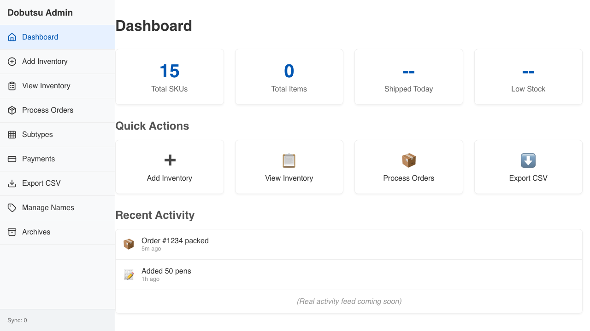

# Dashboard Verification

**As an** admin user
**I want to** See key metrics and navigate to tasks
**So that** I can efficiently manage inventory

### 1. Signed Out State

**Programmatic Verification:**
- [ ] Validated "Sign In" button is visible
- [ ] Validated heading is "Dobutsu Admin"

### 2. Dashboard Loaded

**Programmatic Verification:**
- [ ] Validated Dashboard heading is visible
- [ ] Validated metrics are displayed

### 3. Inventory Entry Form

**Programmatic Verification:**
- [ ] Validated JAN Code input is visible
- [ ] Validated URL is /entry

