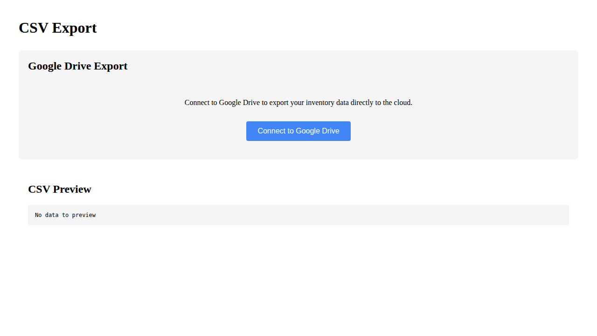
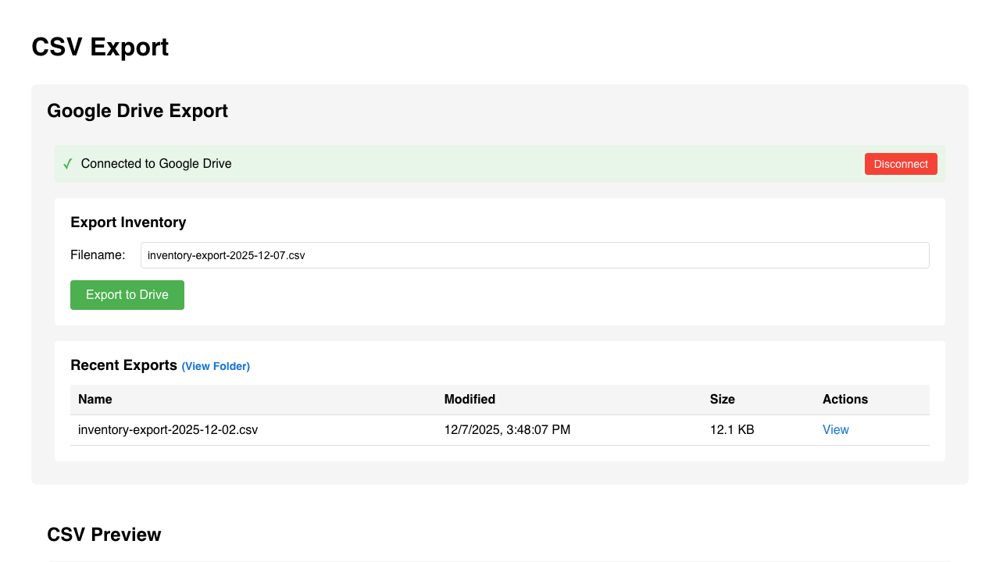
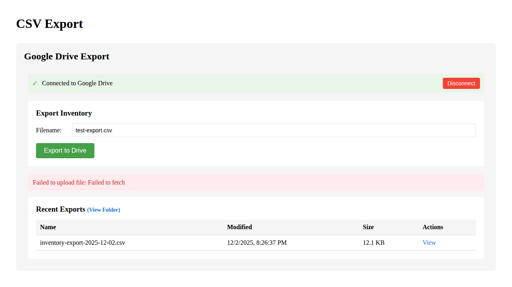

# CSV Export Verification

**As an** admin user  
**I want to** export inventory data to Google Drive  
**So that** I can access CSV files from anywhere and share them with team members

This directory contains documentation for the CSV export page E2E test user story with Google Drive integration.

### 1. Signed Out State


**Programmatic Verification:**
- [ ] Validated "Sign In" button is visible
- [ ] Verified CSV content area is empty (user not authenticated)

**What this shows:**
- User navigates to `/csv` while signed out
- Application displays the sign-in screen
- CSV preview section shows "No data to preview" (user not authenticated)

**Manual verification checklist:**
- [ ] Sign-in button is clearly visible
- [ ] Page layout looks correct
- [ ] CSV preview shows "No data to preview" message

---

### 2. Signed In State (Export Page)

The test follows a complete user journey demonstrating the Google Drive integration UI:

1. User navigates to `/csv` while signed out
2. User signs in with Firebase authentication
3. User sees Google Drive integration UI (connection status, export controls)
4. User views Drive UI structure and elements


**Programmatic Verification:**
- [ ] Validated sign-in button is no longer visible
- [ ] Verified CSV content is displayed
- [ ] Verified Redux store contains authenticated user state

**What this shows:**
- User has successfully signed in
- Page has reloaded with authentication applied
- Application is ready to show CSV export UI

**Manual verification checklist:**
- [ ] Sign-in button is gone
- [ ] Page shows CSV export interface
- [ ] User appears to be authenticated

---

### 3. Drive UI Visible


**What this shows:**
- Google Drive Export section is visible
- CSV Export page title is displayed
- "Connect to Google Drive" button is visible (Drive is configured with mock credentials)
- CSV Preview section is visible below Drive UI
- Drive UI shows authentication prompt with connection button

**Programmatic verification:**
- [ ] "CSV Export" page title is visible
- [ ] "Google Drive Export" section is visible
- [ ] "CSV Preview" section is visible
- [ ] CSV preview content is accessible

**Manual verification checklist:**
- [ ] Page title shows "CSV Export"
- [ ] Google Drive Export section is present
- [ ] "Connect to Google Drive" button is visible
- [ ] CSV Preview section is below Drive UI
- [ ] Page layout is clean and organized

---

### 4. Drive UI Structure


**What this shows:**
- Detailed view of Drive UI with mock credentials configured
- "Connect to Google Drive" button is present in the auth prompt
- Drive section is properly structured with connection controls
- UI shows the authenticated/unauthenticated states correctly

**Programmatic verification:**
- [ ] Drive section element exists (.drive-section)
- [ ] Auth prompt with connection button is present
- [ ] UI structure is valid

**Manual verification checklist:**
- [ ] Drive section is properly structured
- [ ] "Connect to Google Drive" button is visible
- [ ] No JavaScript errors in console
- [ ] Layout remains stable

---

#### 004-authenticated-drive-ui.png



**What this shows:**
- Start of the second test scenario: Complete OAuth and upload flow
- User has authenticated with Firebase
- "Connect to Google Drive" button is visible
- This is the starting point for testing the Drive connection workflow

**Programmatic verification:**
- ✅ User is authenticated with Firebase
- ✅ "Connect to Google Drive" button is visible
- ✅ Page is ready for Drive OAuth flow

**Manual verification checklist:**
- [ ] "Connect to Google Drive" button is clearly visible
- [ ] Page is responsive and ready for interaction

---

#### 005-connected-to-drive.png



**What this shows:**
- **User has connected to Google Drive** (OAuth flow completed via mocked token)
- "Connected to Google Drive" status is displayed
- Filename input field is visible with default value
- "Export to Drive" button is enabled and ready
- Recent exports section may show previously uploaded files

**Programmatic verification:**
- ✅ "Connected to Google Drive" status indicator visible
- ✅ Filename input field is present
- ✅ "Export to Drive" button is visible and enabled

**Manual verification checklist:**
- [ ] Connection status clearly shows user is connected
- [ ] Filename input has default value (inventory-export-YYYY-MM-DD.csv)
- [ ] Export button is clickable
- [ ] Layout is clean and functional

---

#### 006-upload-complete.png



**What this shows:**
- **CSV file has been uploaded** (using mocked Drive API response)
- User entered filename "test-export.csv" and clicked "Export to Drive"
- Upload process completed
- UI may show success message or updated file list

**Programmatic verification:**
- ✅ Upload action was triggered
- ✅ Mocked Drive API responded successfully
- ✅ Page state updated after upload

**Manual verification checklist:**
- [ ] Upload completed without errors
- [ ] UI provides feedback about upload status
- [ ] File appears in recent exports (if visible)

---

## Test Scenarios

The test includes two comprehensive scenarios that together demonstrate the complete Google Drive integration:

### 1. **Drive UI Visibility Test** (Screenshots 000-003)
- **Purpose**: Validates that the Drive integration UI renders correctly
- Tests the user journey from signed-out to viewing Drive UI
- Captures 4 screenshots showing authentication and Drive UI presence
- **Does NOT test**: Actual Drive connection or file upload (that's in Test 2)

**Flow:**
1. Screenshot 000: User not signed in
2. Screenshot 001: User signs in with Firebase
3. Screenshot 002: Drive UI is visible with "Connect to Google Drive" button
4. Screenshot 003: Drive UI structure validation

### 2. **Complete OAuth and Upload Flow** (Screenshots 004-006)
- **Purpose**: Tests the complete end-to-end Drive integration with mocked APIs
- Demonstrates user connecting to Drive and uploading a CSV file
- Uses Playwright route mocking to simulate Google Drive API responses

**Flow:**
1. Screenshot 004: User authenticated, ready to connect to Drive
2. Screenshot 005: **User connected to Drive** - shows filename input and export button
3. Screenshot 006: **CSV uploaded** - shows completion state after export

**API Mocking:**
- Mocks OAuth by injecting access token to localStorage
- Mocks `GET /drive/v3/files` → returns sample file list  
- Mocks `POST /upload/drive/v3/files` → returns upload success

This second test demonstrates the complete user story: "As an admin, I want to export inventory to Google Drive" including connection, filename selection, and successful upload.

## Google Drive Configuration

With the mock credentials configured in the test environment, users see:

- "Connect to Google Drive" button (when not authenticated to Drive)
- This demonstrates the Drive integration UI is properly configured
- Mock credentials (`test-client-id.apps.googleusercontent.com`) show UI without real API access

When a user would connect in production (with real credentials):
- Connection status indicator when authenticated
- Filename input field (defaults to `inventory-export-YYYY-MM-DD.csv`)
- "Export to Drive" button
- Recent exports table showing files in Drive folder
- "View Folder" link to open Drive folder

## Test Data

The test uses data loaded from `test-data/firestore-export.json` into the Firebase emulator. The CSV export reflects the current inventory state.

**Google Drive API Mocking:**
The second test scenario uses Playwright's route mocking to intercept and mock Google Drive API calls:
- `GET /drive/v3/files` - Returns mock file list
- `POST /upload/drive/v3/files` - Returns mock upload success response

This allows testing the complete upload flow without requiring real Google API credentials.

## Running This Test

```bash
# Run only this test
npx playwright test e2e/002-csv

# Interactive UI mode
npx playwright test e2e/002-csv --ui

# Headed mode (see browser)
npx playwright test e2e/002-csv --headed
```

## Related Documentation

- [E2E Test Overview](../README.md)
- [E2E Test Guidelines](../../E2E_TEST_GUIDELINES.md)
- [Google Drive CSV Setup](../../GOOGLE_DRIVE_CSV_SETUP.md)
