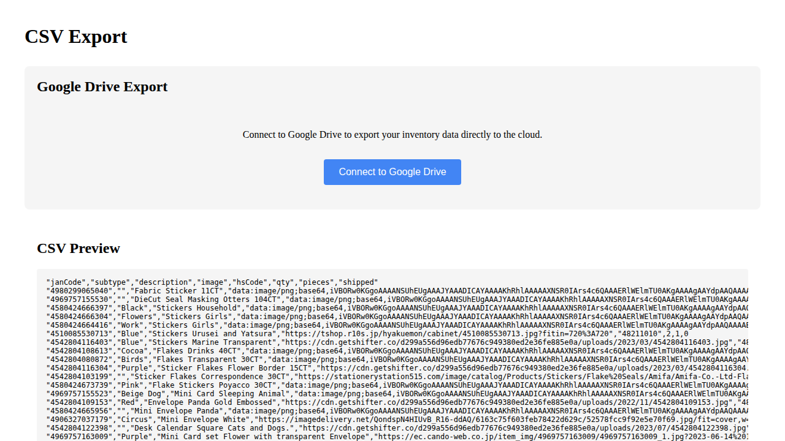

# CSV Export Verification

**As an** admin user  
**I want to** export inventory data to Google Drive  
**So that** I can access CSV files from anywhere and share them with team members

This directory contains documentation for the CSV export page E2E test user story with Google Drive integration.

### 1. Signed Out State


**Programmatic Verification:**
- [ ] Validated "Sign In" button is visible
- [ ] Verified CSV content area is empty (user not authenticated)

**What this shows:**
- User navigates to `/csv` while signed out
- Application displays the sign-in screen
- CSV preview section shows "No data to preview" (user not authenticated)

**Manual verification checklist:**
- [ ] Sign-in button is clearly visible
- [ ] Page layout looks correct
- [ ] CSV preview shows "No data to preview" message

---

### 2. Signed In State (Export Page)

The test follows a complete user journey demonstrating the Google Drive integration UI:

1. User navigates to `/csv` while signed out
2. User signs in with Firebase authentication
3. User sees Google Drive integration UI (connection status, export controls)
4. User views Drive UI structure and elements


**Programmatic Verification:**
- [ ] Validated sign-in button is no longer visible
- [ ] Verified CSV content is displayed
- [ ] Verified Redux store contains authenticated user state

**What this shows:**
- User has successfully signed in
- Page has reloaded with authentication applied
- Application is ready to show CSV export UI

**Manual verification checklist:**
- [ ] Sign-in button is gone
- [ ] Page shows CSV export interface
- [ ] User appears to be authenticated

---

### 3. Drive UI Visible


**What this shows:**
- Google Drive Export section is visible
- CSV Export page title is displayed
- Google Drive section heading present
- CSV Preview section is visible below Drive UI
- Since Drive is not configured in test environment, shows "not configured" message

**Programmatic verification:**
- [ ] "CSV Export" page title is visible
- [ ] "Google Drive Export" section is visible
- [ ] "CSV Preview" section is visible
- [ ] CSV preview content is accessible

**Manual verification checklist:**
- [ ] Page title shows "CSV Export"
- [ ] Google Drive Export section is present
- [ ] CSV Preview section is below Drive UI
- [ ] "Not configured" message shown (expected in test env)
- [ ] Page layout is clean and organized

---

### 4. Drive UI Structure



**What this shows:**
- Detailed view of Drive UI structure
- Drive section element exists in DOM
- Authentication prompt or "not configured" message is present
- UI gracefully handles missing Drive configuration

**Programmatic verification:**
- [ ] Drive section element exists (.drive-section)
- [ ] Either auth prompt or "not configured" message is present
- [ ] UI structure is valid

**Manual verification checklist:**
- [ ] Drive section is properly structured
- [ ] Appropriate message shown based on configuration
- [ ] No JavaScript errors in console
- [ ] Layout remains stable

---

## Test Scenarios

The test includes two comprehensive scenarios:

### 1. **Complete CSV Export with Drive UI Workflow**
- Tests the full user journey from signed-out to viewing Drive integration
- Captures 4 screenshots (000-003) showing the progression
- Validates UI elements and authentication states
- Shows the Drive UI with "Connect to Google Drive" button

### 2. **Complete Google Drive OAuth and Upload Flow**
- Tests the full end-to-end Drive integration including OAuth and upload
- Uses mocked Google Drive API responses (no real Drive credentials needed)
- Demonstrates:
  - User authentication with Firebase
  - Drive OAuth connection (mocked)
  - Filename input and CSV upload
  - Upload success verification
- Captures 4 additional screenshots (004-007) showing:
  - 004-authenticated-drive-ui: Drive connection button visible
  - 005-connected-to-drive: Connected state with export form
  - 006-upload-complete: Successful CSV upload
  - 007+ (if needed): Additional verification steps

**Note:** The second test uses Playwright's route mocking to simulate Google Drive API responses, allowing complete flow testing without real Google credentials.

## Google Drive Configuration

When Google Drive is properly configured (not in test environment), users would see:

- "Connect to Google Drive" button (if not authenticated)
- Connection status indicator when authenticated
- Filename input field (defaults to `inventory-export-YYYY-MM-DD.csv`)
- "Export to Drive" button
- Recent exports table showing files in Drive folder
- "View Folder" link to open Drive folder

In the test environment (without Drive configuration):
- A "not configured" message is displayed
- This is the expected behavior and validates graceful degradation

## Test Data

The test uses data loaded from `test-data/firestore-export.json` into the Firebase emulator. The CSV export reflects the current inventory state.

**Google Drive API Mocking:**
The second test scenario uses Playwright's route mocking to intercept and mock Google Drive API calls:
- `GET /drive/v3/files` - Returns mock file list
- `POST /upload/drive/v3/files` - Returns mock upload success response

This allows testing the complete upload flow without requiring real Google API credentials.

## Running This Test

```bash
# Run only this test
npx playwright test e2e/002-csv

# Interactive UI mode
npx playwright test e2e/002-csv --ui

# Headed mode (see browser)
npx playwright test e2e/002-csv --headed
```

## Related Documentation

- [E2E Test Overview](../README.md)
- [E2E Test Guidelines](../../E2E_TEST_GUIDELINES.md)
- [Google Drive CSV Setup](../../GOOGLE_DRIVE_CSV_SETUP.md)
