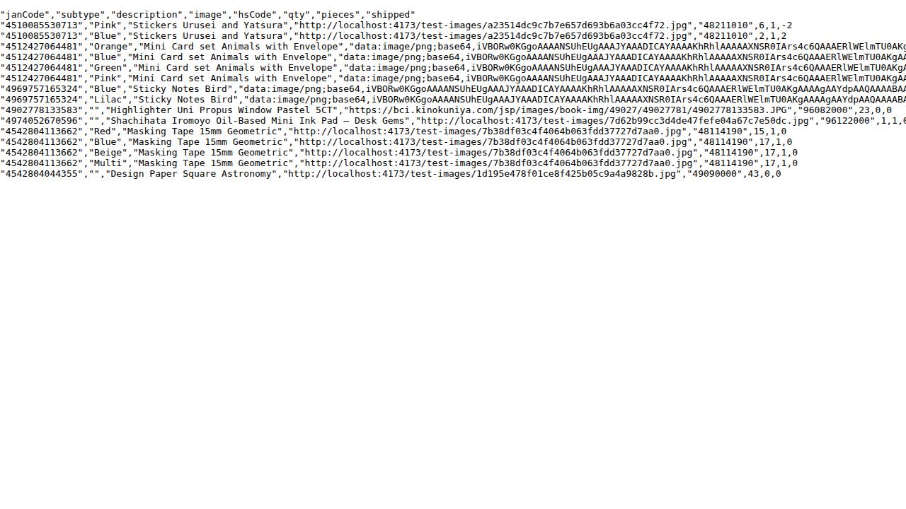
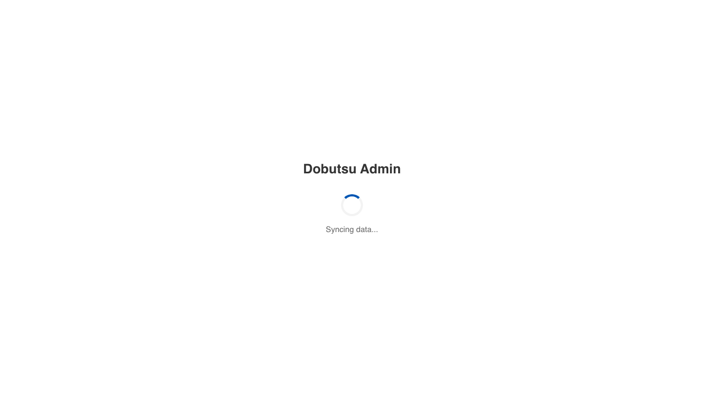
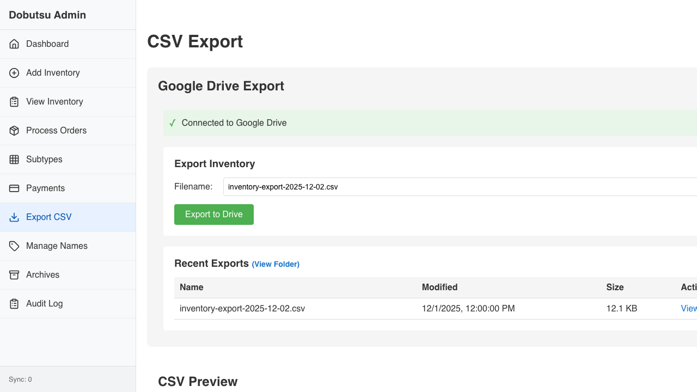
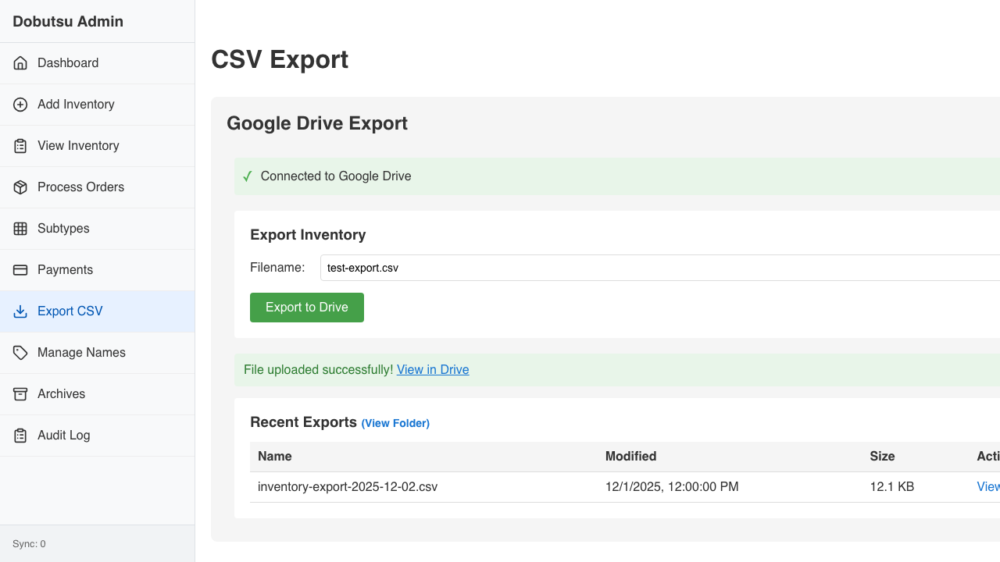

# CSV Export Verification

**As an** admin user
**I want to** export inventory data to Google Drive
**So that** I can analyze it in other tools

### 1. Signed Out State

**Programmatic Verification:**
- [ ] Validated "Sign In" button is visible

### 2. Signed In State

**Programmatic Verification:**
- [ ] Validated sign-in button is no longer visible
- [ ] Verified CSV content is displayed

### 3. Drive UI Visible

**Programmatic Verification:**
- [ ] Validated Drive Export section is visible
- [ ] Validated Connect button is visible

### 4. Connected to Drive

**Programmatic Verification:**
- [ ] Validated Connected status is visible
- [ ] Validated Export button is visible

### 5. Upload Complete

**Programmatic Verification:**
- [ ] Validated upload triggered successfully

