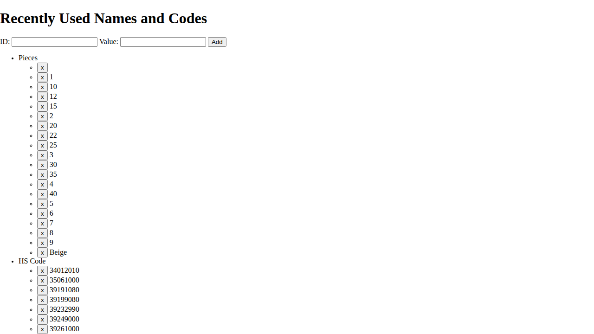
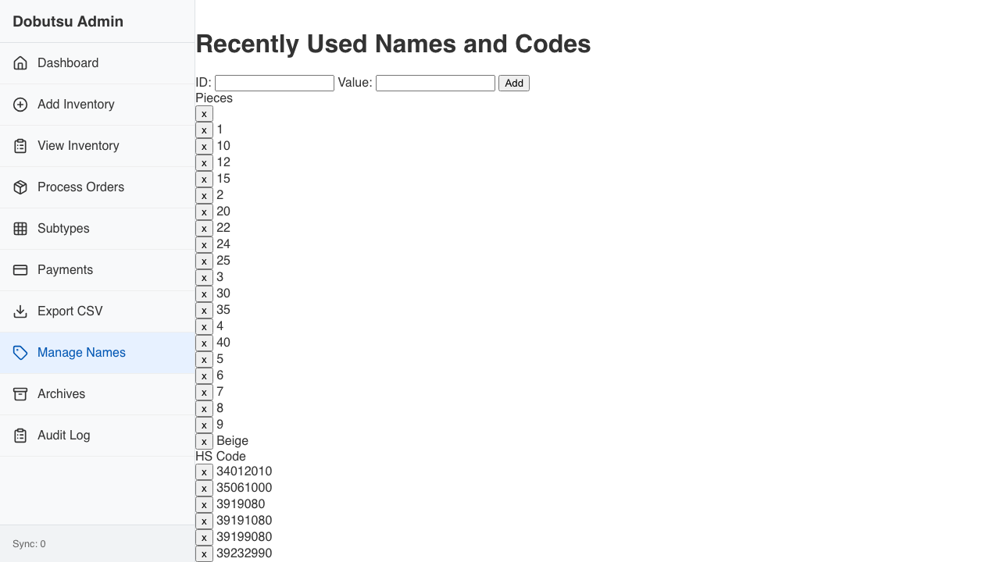

# Names Verification

**As an** admin user
**I want to** manage recently used names
**So that** I can ensure data consistency

### 1. Signed Out State

**Programmatic Verification:**
- [ ] Validated "Sign In" button is visible
- [ ] Validated heading contains "Recently Used Names"

### 2. Signed In State

**Programmatic Verification:**
- [ ] Validated "Sign In" button is hidden
- [ ] Validated Redux store has user state

### 3. Names Page Loaded

**Programmatic Verification:**
- [ ] Validated heading is "Recently Used Names"
- [ ] Validated ID input is visible
- [ ] Validated Value input is visible
- [ ] Validated Add button is visible
- [ ] Validated Redux store has names state

