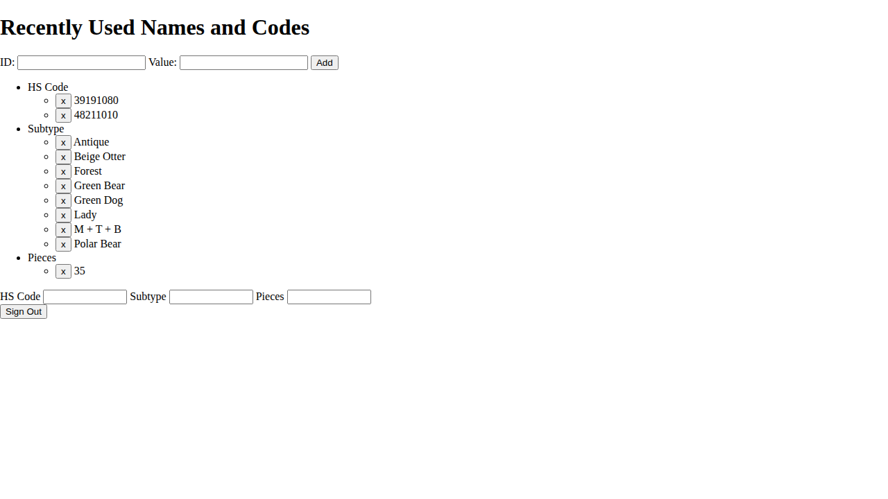

# Names Page E2E Test

This directory contains documentation for the names page E2E test user story.

## User Story

**As an** admin user  
**I want to** manage recently used names and codes  
**So that** I can quickly access frequently used values

## Test Flow

The test follows a complete user journey from signed-out state through viewing the names management page.

### Screenshots

Screenshots are numbered sequentially to tell the story.

#### 000-signed-out-state.png


**What this shows:**
- User navigates to `/names` while signed out
- Application displays the sign-in screen
- Page heading shows "Recently Used Names and Codes"

**Programmatic verification:**
- ✅ Sign-in button is visible
- ✅ Page heading is correct

**Manual verification checklist:**
- [ ] Sign-in button is clearly visible
- [ ] Page heading shows "Recently Used Names and Codes"

---

#### 001-signed-in-state.png


**What this shows:**
- User has successfully signed in
- Page has reloaded with authentication applied

**Programmatic verification:**
- ✅ Sign-in button is no longer visible
- ✅ User is authenticated

**Manual verification checklist:**
- [ ] Sign-in button is gone
- [ ] Page shows names management interface

---

#### 002-names-loaded.png



**What this shows:**
- Names management page is fully loaded
- Form for adding new names is visible
- ID and Value input fields are ready

**Programmatic verification:**
- ✅ Page heading shows "Recently Used Names"
- ✅ ID input is visible
- ✅ Value input is visible
- ✅ Add button is visible
- ✅ Redux store has names state

**Manual verification checklist:**
- [ ] Heading is correct
- [ ] ID input field exists
- [ ] Value input field exists
- [ ] Add button is visible
- [ ] Page layout is correct

---

## Running This Test

```bash
# Run only this test
npx playwright test e2e/003-names

# Interactive UI mode
npx playwright test e2e/003-names --ui
```

## Related Documentation

- [E2E Test Overview](../README.md)
- [E2E Test Guidelines](../../E2E_TEST_GUIDELINES.md)
