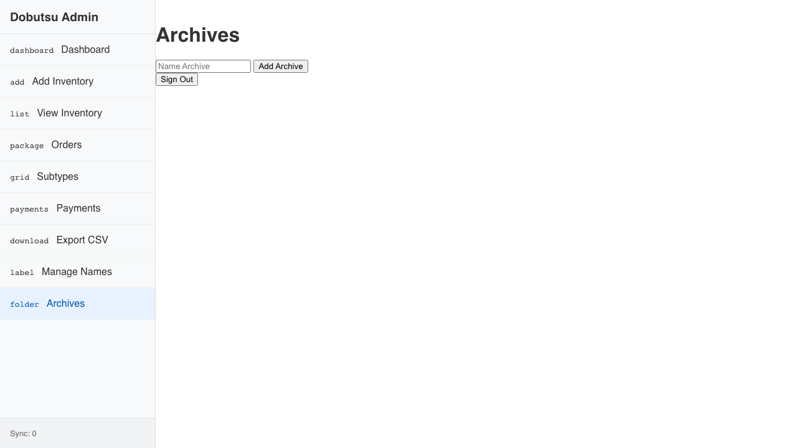

# Archives Verification

**As an** admin user
**I want to** view sales archives
**So that** I can access historical data

### 1. Signed Out State

**Programmatic Verification:**
- [ ] Validated "Sign In" button is visible

### 2. Signed In State

**Programmatic Verification:**
- [ ] Validated user is authenticated

### 3. Archives Loaded

**Programmatic Verification:**
- [ ] Validated archives list is visible
- [ ] Checked for presence of historical archives
