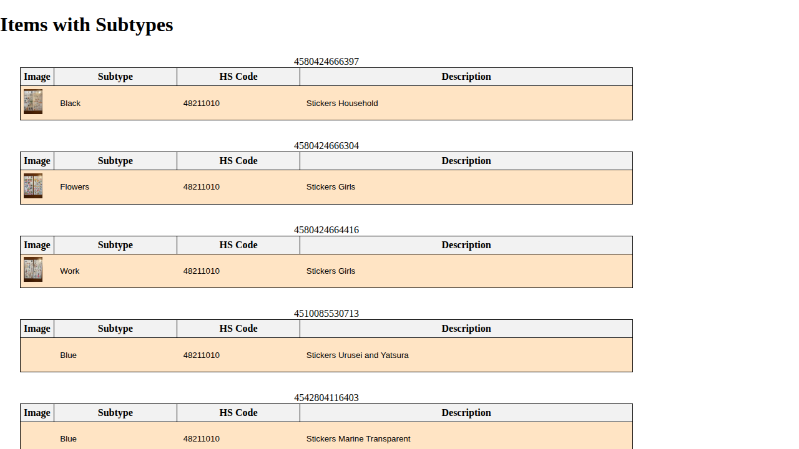
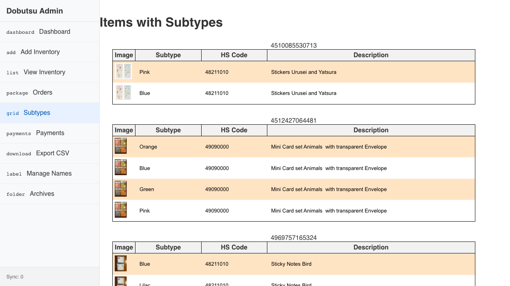

# Subtypes Verification

**As an** admin user
**I want to** view items with subtypes
**So that** I can manage product variations

### 1. Signed Out State

**Programmatic Verification:**
- [ ] Validated "Sign In" button is visible
- [ ] Validated heading contains "Items with Subtypes"

### 2. Signed In State

**Programmatic Verification:**
- [ ] Validated "Sign In" button is hidden
- [ ] Validated Redux store has user state

### 3. Subtypes Loaded

**Programmatic Verification:**
- [ ] Validated heading contains "Items with Subtypes"
- [ ] Validated Redux inventory state

