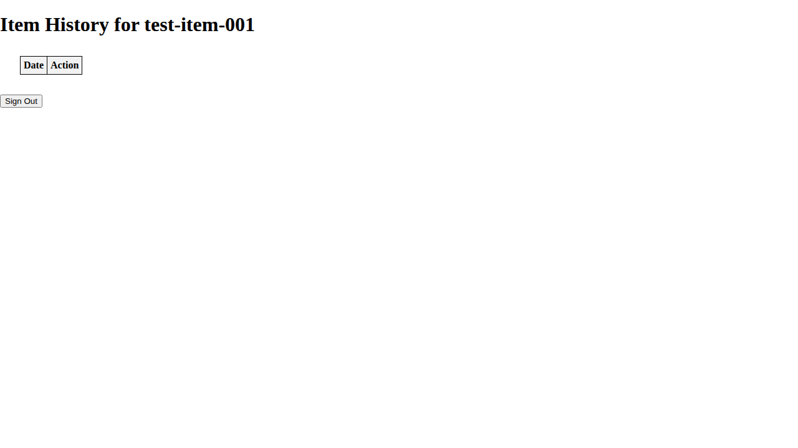
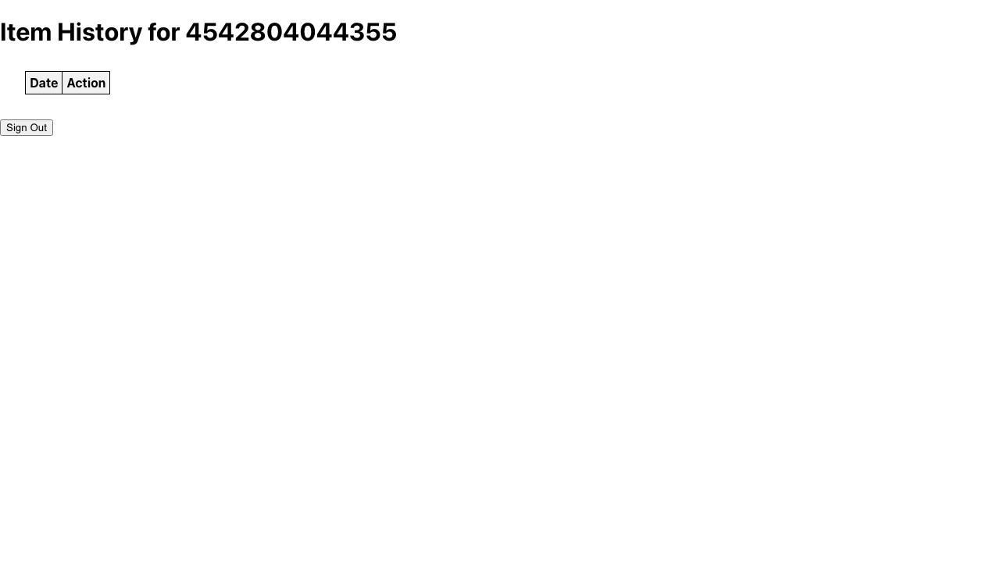

# Item History Verification

**As an** admin user
**I want to** view item history
**So that** I can track changes to inventory items

### 1. Signed Out State

**Programmatic Verification:**
- [ ] Validated "Sign In" button is visible

### 2. Signed In State

**Programmatic Verification:**
- [ ] Validated user is authenticated

### 3. History Loaded

**Programmatic Verification:**
- [ ] Validated history list is visible
- [ ] Checked that recent changes are displayed
