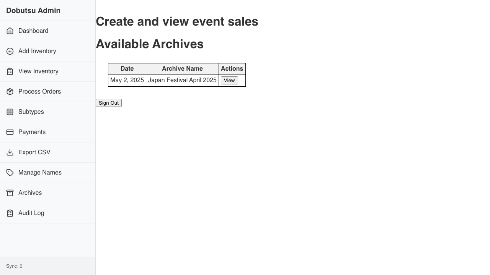
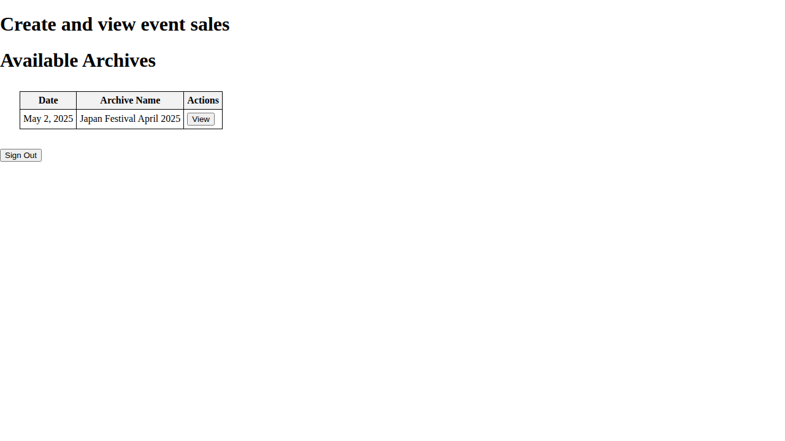

# Shows Verification

**As an** admin user
**I want to** manage event sales
**So that** I can track sales performance

### 1. Signed Out State

**Programmatic Verification:**
- [ ] Validated "Sign In" button is visible
- [ ] Validated heading contains "Create and view event sales"

### 2. Signed In State

**Programmatic Verification:**
- [ ] Validated "Sign In" button is hidden
- [ ] Validated Redux store has user state

### 3. Shows Loaded

**Programmatic Verification:**
- [ ] Validated heading contains "Create and view event sales"
- [ ] Validated "Available Archives" heading (if visible)
- [ ] Validated table exists (if visible)
- [ ] Validated Redux store has sales events state

