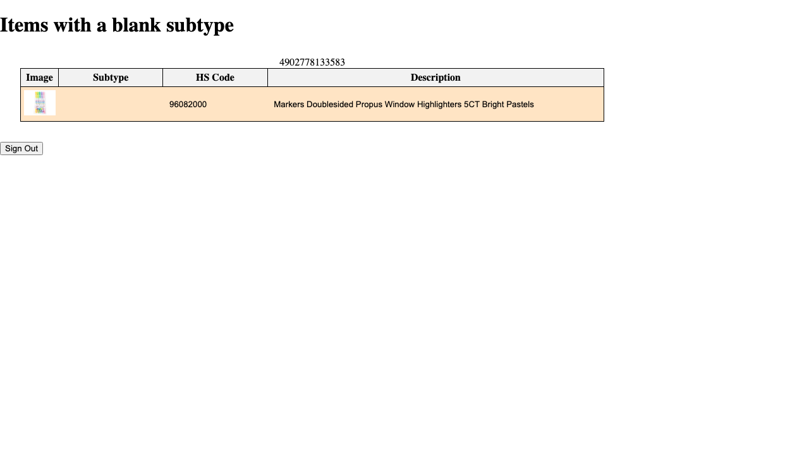
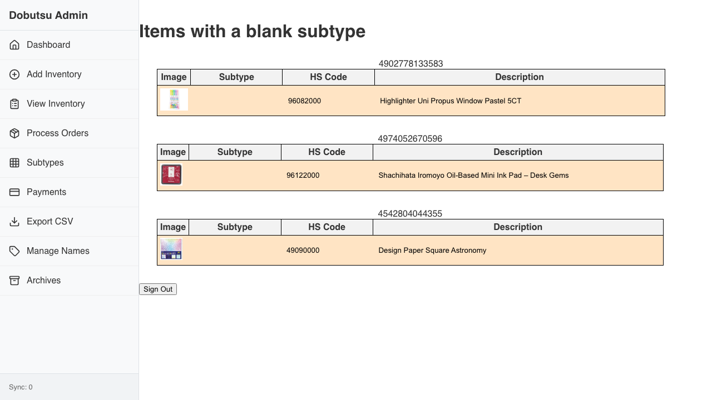

# JAN Codes Verification

**As an** admin user
**I want to** lookup JAN codes
**So that** I can identify products

### 1. Signed Out State

**Programmatic Verification:**
- [ ] Validated "Sign In" button is visible

### 2. Signed In State

**Programmatic Verification:**
- [ ] Validated user is authenticated

### 3. JAN Codes Loaded

**Programmatic Verification:**
- [ ] Validated JAN code list is visible
- [ ] Checked that product details match the code
