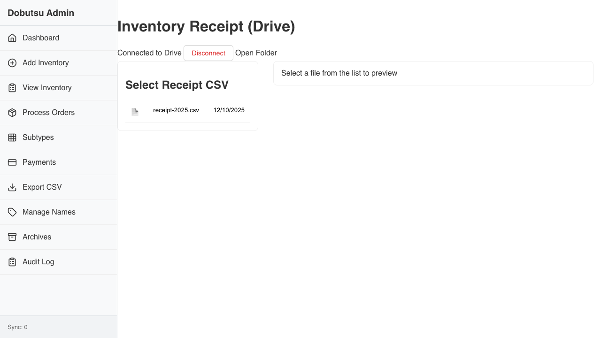
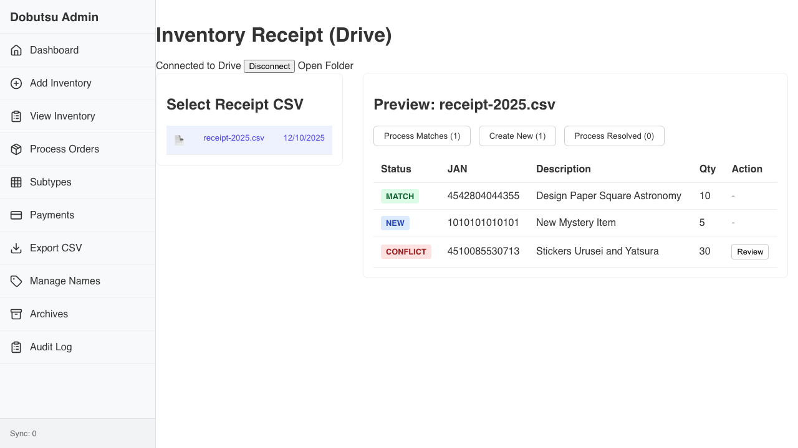
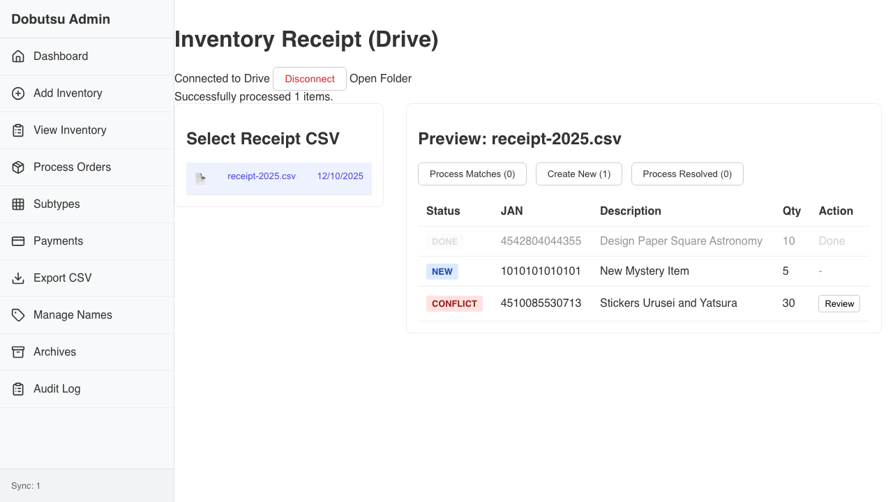
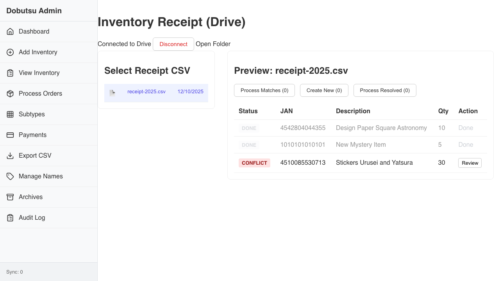
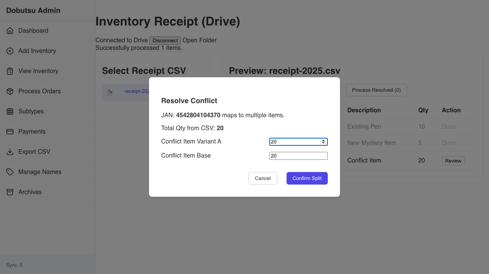
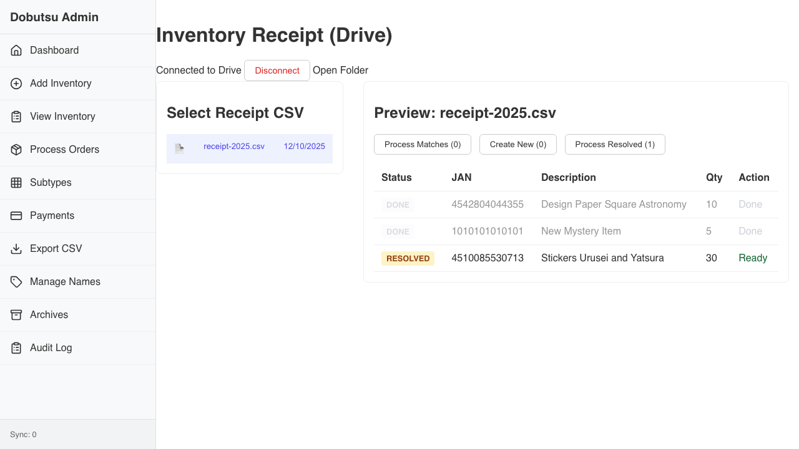
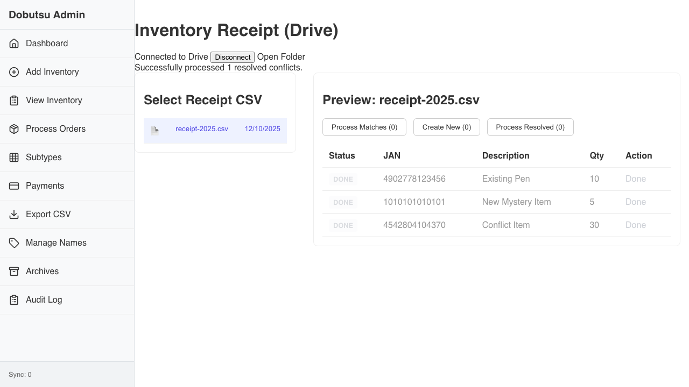

# Inventory Receipt Verification

**As an** admin user
**I want to** import inventory from CSV receipts
**So that** I can update stock quantities, create draft items, and resolve subtype allocations.

### 1. View File List

**Programmatic Verification:**
- [ ] App should be connected to Drive
- [ ] CSV file should be listed

### 2. Verify Preview

**Programmatic Verification:**
- [ ] Preview Header Visible
- [ ] Batch Actions Visible
- [ ] Row 1: New Item (5555...)
- [ ] Row 2: Existing or Conflict
- [ ] Row 3: Existing Pen (490...)

### 3. Process Matches

**Programmatic Verification:**
- [ ] Click Match Button

### 4. Process New Items

**Programmatic Verification:**
- [ ] Click Create New Button

### 5. Open Conflict Modal

**Programmatic Verification:**
- [ ] Open Review Modal

### 6. Confirm Conflict Resolution

**Programmatic Verification:**
- [ ] Confirm Split

### 7. Process Resolved

**Programmatic Verification:**
- [ ] Click Process Resolved button
- [ ] Success message displayed

