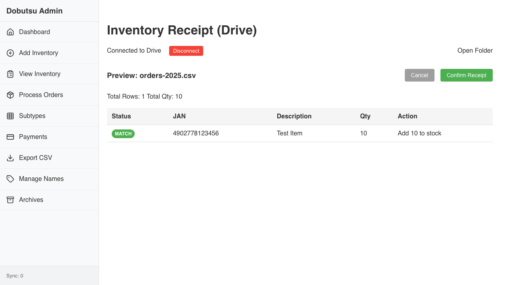

# Inventory Receipt Verification

**As an** admin user
**I want to** import inventory from CSV receipts
**So that** I can update stock quantities, create draft items, and resolve subtype allocations.

### 1. View File List

**Programmatic Verification:**
- [ ] App should be connected to Drive
- [ ] CSV file should be listed

### 2. Analysis Preview

**Programmatic Verification:**
- [ ] Preview Header Visible
- [ ] Row 1: New Item (9999...)
- [ ] Row 2: Existing or Conflict
- [ ] Total Qty Summary

### 3. Import Complete

**Programmatic Verification:**
- [ ] Success message displayed

