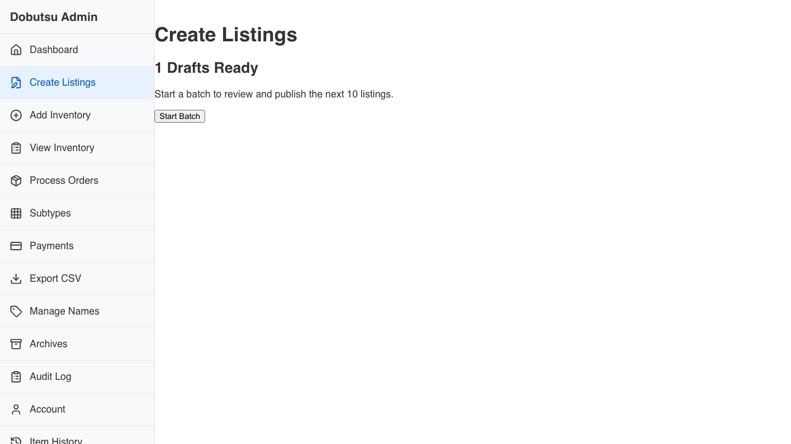
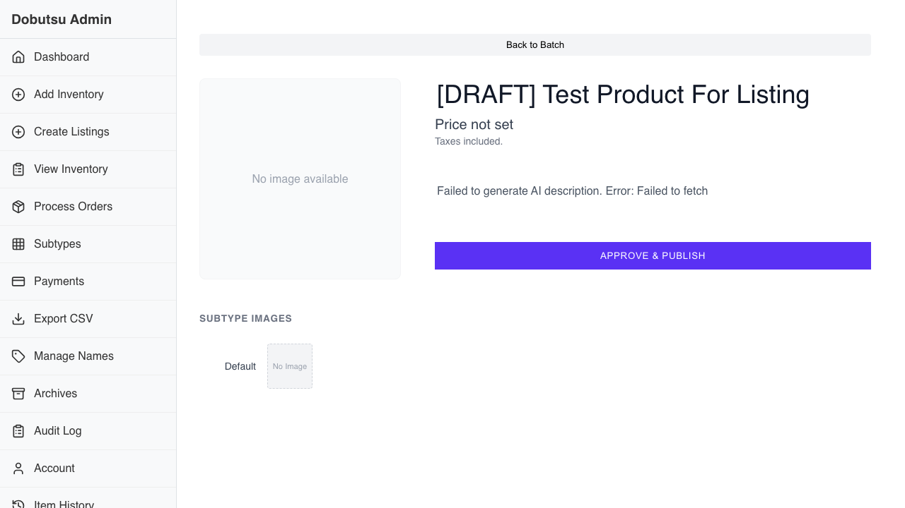
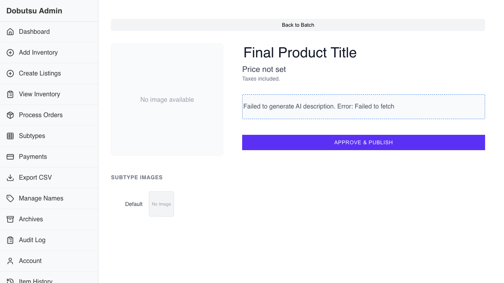

# Listings Creation Verification

**As a** merchant
**I want to** semi-automatically create listings from inventory photos
**So that** I can list products faster and reduce manual data entry.

### 1. Initial State

**Programmatic Verification:**
- [ ] Validated header is visible

### 2. Drafts Ready

**Programmatic Verification:**
- [ ] Validated drafts are ready

### 3. Batch Editor

**Programmatic Verification:**
- [ ] Validated Batch Editor is visible

### 4. Review Proposal

**Programmatic Verification:**
- [ ] Validated redirected to listing detail with draft title

### 5. Edited Proposal

**Programmatic Verification:**
- [ ] Validated edited title

### 6. Batch Complete

**Programmatic Verification:**
- [ ] Validated batch complete and empty state

