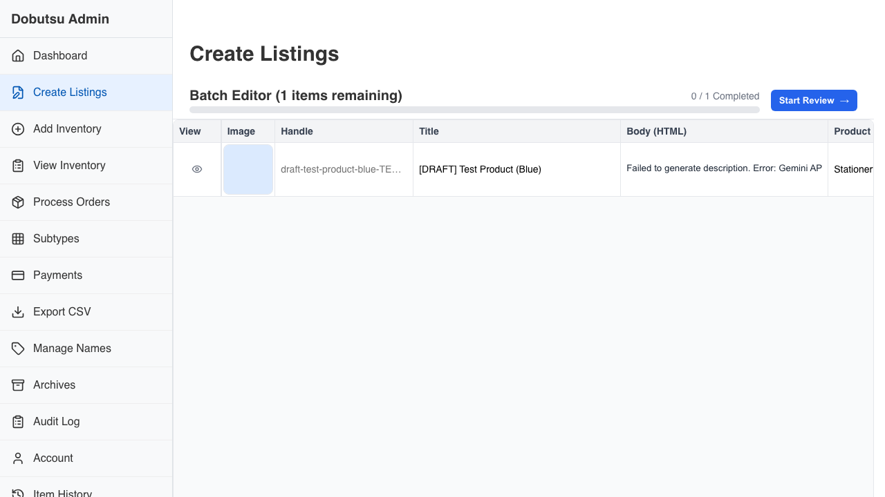
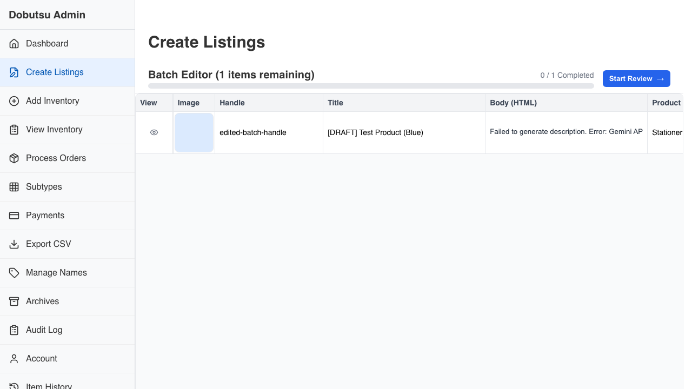
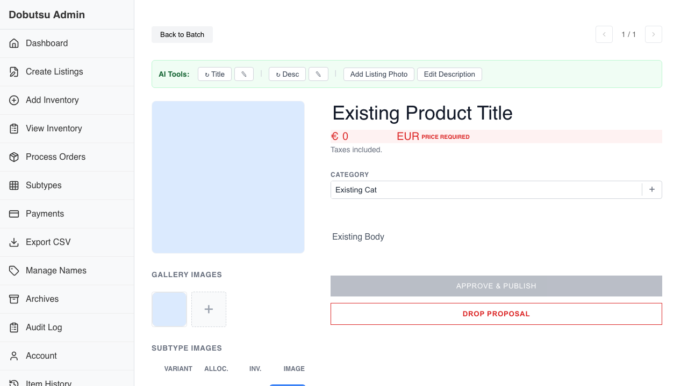

# Listings Creation Verification

**As a** merchant
**I want to** semi-automatically create listings from inventory photos
**So that** I can list products faster and reduce manual data entry.

### 1. Initial State

**Programmatic Verification:**
- [ ] Validated header is visible

### 2. Batch Editor Variants

**Programmatic Verification:**
- [ ] Validated Batch Editor is visible with a draft row

### 3. Batch Editor Handle Edit

**Programmatic Verification:**
- [ ] Validated handle edit in Batch Editor

### 4. Merge Existing

**Programmatic Verification:**
- [ ] Validated merge with existing listing context update

### 5. Review Listing

**Programmatic Verification:**
- [ ] Validated Review View

