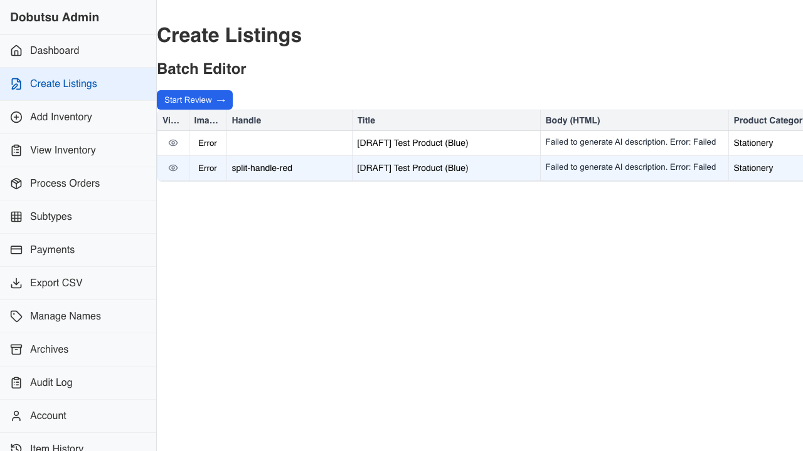
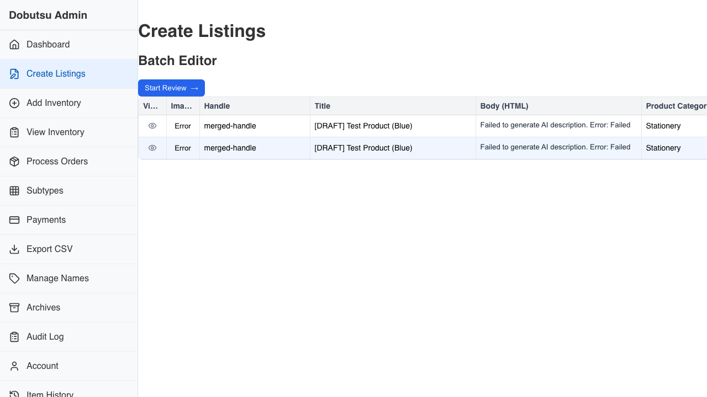
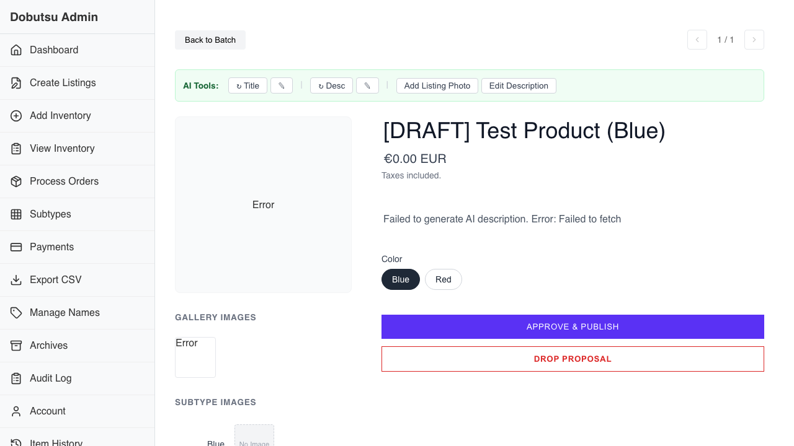

# Listings Creation Verification

**As a** merchant
**I want to** semi-automatically create listings from inventory photos
**So that** I can list products faster and reduce manual data entry.

### 1. Initial State

**Programmatic Verification:**
- [ ] Validated header is visible

### 2. Batch Editor Variants

**Programmatic Verification:**
- [ ] Validated Batch Editor is visible with 2 variant rows

### 3. Variant Split

**Programmatic Verification:**
- [ ] Validated Variant Split via Handle change

### 4. Variant Merge

**Programmatic Verification:**
- [ ] Validated Variant Merge via Handle change

### 5. Review Multi-Variant

**Programmatic Verification:**
- [ ] Validated Review View for Multi-Variant

