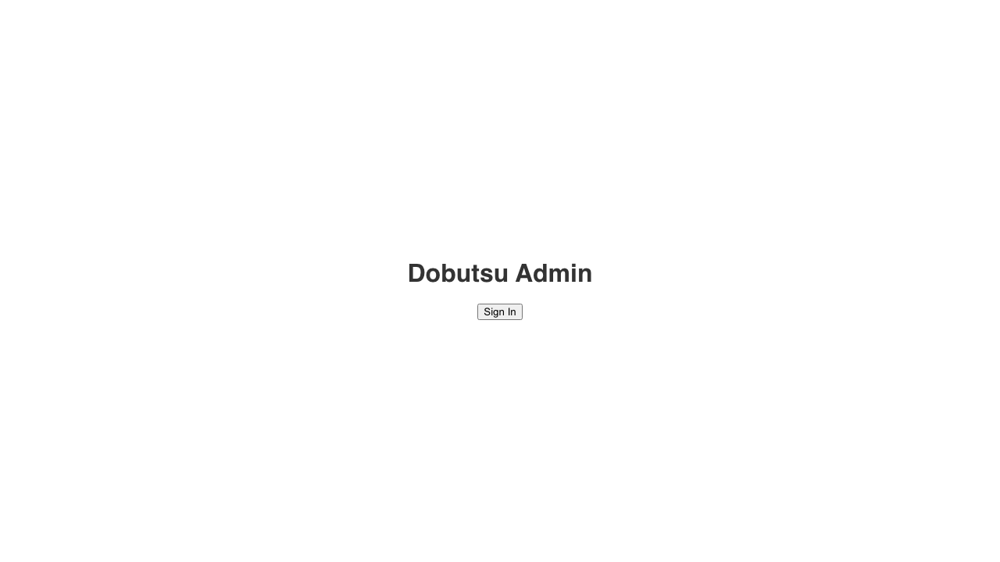
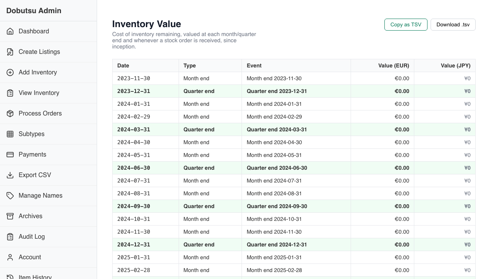

# Inventory Value Report

**As an** admin/accountant
**I want to** see inventory value at each period end and stock order
**So that** I can report inventory value over time

### 1. Signed Out State

**Programmatic Verification:**
- [ ] Validated "Sign In" button is visible

### 2. Signed In State

**Programmatic Verification:**
- [ ] Validated "Sign In" button is hidden

### 3. Report Loaded

**Programmatic Verification:**
- [ ] Validated heading is "Inventory Value"
- [ ] Validated report table or empty state is shown
- [ ] Validated "Copy as TSV" export control exists

