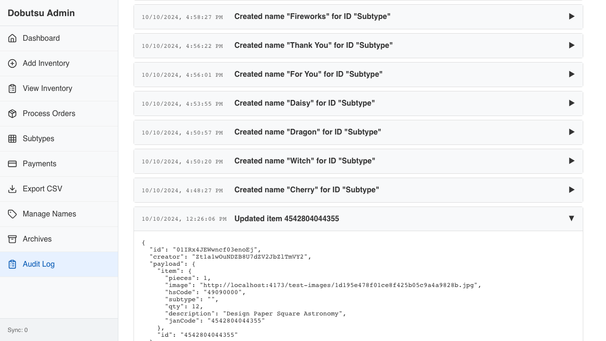

# Audit Log Rich Data

Verify audit log displays correctly for a known date (2024-10-10) with multiple actions, featuring human-readable descriptions.

### 1. Rich Data View

**Programmatic Verification:**
- [ ] Validated specific action is visible
- [ ] Validated human-readable description matches

### 2. Action Details

**Programmatic Verification:**
- [ ] Validated expanded JSON details

