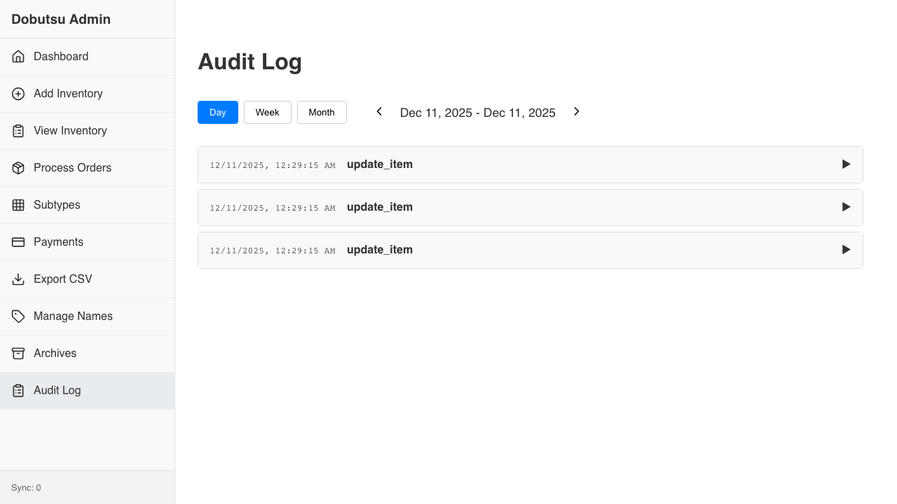

# Audit Log Verification

**As an** admin user
**I want to** view and filter the history of actions
**So that** I can audit system usage and debug issues

### 1. Initial Audit View

**Programmatic Verification:**
- [ ] Validated Audit Log page loaded
- [ ] Validated "Day" view is active by default

### 2. Filtered View

**Programmatic Verification:**
- [ ] Validated "Month" view is active
- [ ] Validated Date Range text updated after navigation

### 3. Empty State

**Programmatic Verification:**
- [ ] Verified empty state (no cards)

