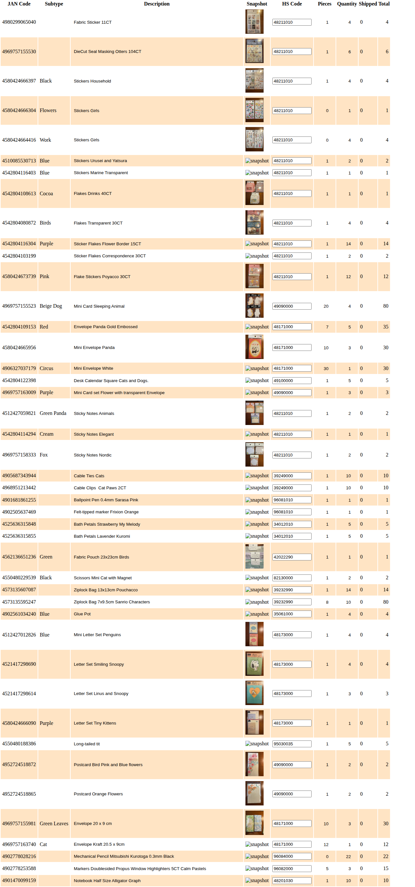

# Inventory Page E2E Test

This directory contains documentation for the inventory page E2E test user story.

## User Story

**As an** admin user  
**I want to** view the inventory  
**So that** I can see current stock levels

## Test Flow

The test follows a complete user journey from signed-out state through viewing inventory data.

### Screenshots

Screenshots are numbered sequentially to tell the story:

#### 000-signed-out-state.png


**What this shows:**
- User navigates to `/inventory` while signed out
- Application displays the sign-in screen
- "Sign In" button is prominently displayed

**Programmatic verification:**
- ✅ Sign-in button is visible
- ✅ No console errors (except transient auth initialization)

**Manual verification checklist:**
- [ ] Sign-in button is clearly visible
- [ ] Page layout looks correct
- [ ] No error messages displayed (except expected auth prompts)

---

#### 001-signed-in-state.png



**What this shows:**
- User has successfully signed in
- Page has reloaded with authentication applied
- Application is preparing to load inventory data

**Programmatic verification:**
- ✅ Sign-in button is no longer visible
- ✅ User is authenticated

**Manual verification checklist:**
- [ ] Sign-in button is gone
- [ ] Page shows loading state or navigation elements
- [ ] User appears to be authenticated

---

#### 002-inventory-loaded.png


**What this shows:**
- Inventory table is fully loaded with data
- Data from Firestore emulator is displayed
- Table shows inventory items with all expected columns

**Programmatic verification:**
- ✅ Inventory table is visible
- ✅ Table headers include "JAN Code" and "Quantity"
- ✅ At least one inventory row is displayed
- ✅ Sample rows have valid data structure
- ✅ No significant console errors

**Manual verification checklist:**
- [ ] Table is visible and properly formatted
- [ ] Headers match expected columns (JAN Code, Name, Quantity, etc.)
- [ ] Multiple inventory items are displayed
- [ ] Data appears accurate and complete
- [ ] No visual glitches or rendering issues
- [ ] Images (if any) are loading correctly
- [ ] Table is scrollable if there are many items

---

## Test Data

The test uses data loaded from `test-data/firestore-export.json` into the Firebase emulator. This includes:

- **broadcast collection**: Action history for Redux state reconstruction
- **users collection**: Admin user data
- **Inventory items**: Created through broadcast actions

The test loads 400 broadcast events using the `--prefix=400` flag.

## Running This Test

```bash
# Full test with emulator management
npm run test:e2e

# Simple test (assumes emulators running)
npm run test:e2e:simple

# Interactive UI mode
npm run test:e2e:ui

# Headed mode (see browser)
npm run test:e2e:headed
```

## Updating Screenshots

**⚠️ IMPORTANT:** Baseline screenshots must be committed by test authors and PRs. CI will NOT regenerate baselines.

### When to update baselines:

1. **New tests:** Generate initial baselines when creating the test
2. **UI changes:** Regenerate baselines when your PR changes the visual appearance
3. **Test changes:** Regenerate if the test flow changes

### How to update:

```bash
# Generate/update baselines locally
npx playwright test --update-snapshots

# Verify the screenshots look correct
# Then commit them with your PR
git add e2e/inventory.spec.ts-snapshots/
git commit -m "Update inventory baseline screenshots"
```

**Note:** If baselines are missing or outdated, CI tests will fail. Always commit baseline screenshots with your PR.

## Troubleshooting

### Screenshots don't match

1. Check if the UI change was intentional
2. Review the diff in `test-results/`
3. If intentional, update baselines with `--update-snapshots` and **commit them**
4. If not, fix the code

### Data not loading

1. Verify emulators are running: `curl http://localhost:8080`
2. Check test data is loaded: `node e2e/helpers/load-test-data.js --prefix=400`
3. Rebuild application: `npm run build:local`

### Test timeout

1. Increase timeout in test file (currently 120 seconds)
2. Check network/emulator performance
3. Reduce test data size with lower `--prefix` value

## Related Documentation

- [E2E Test Overview](../README.md)
- [E2E Setup Summary](../../E2E_SETUP_SUMMARY.md)
- [Playwright Configuration](../../playwright.config.ts)
