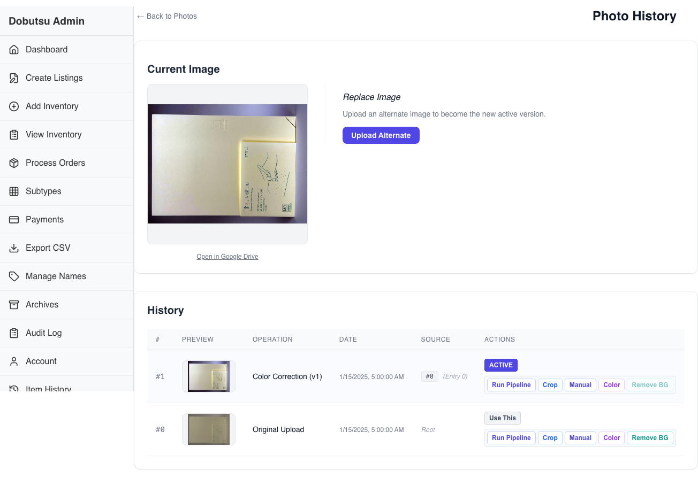
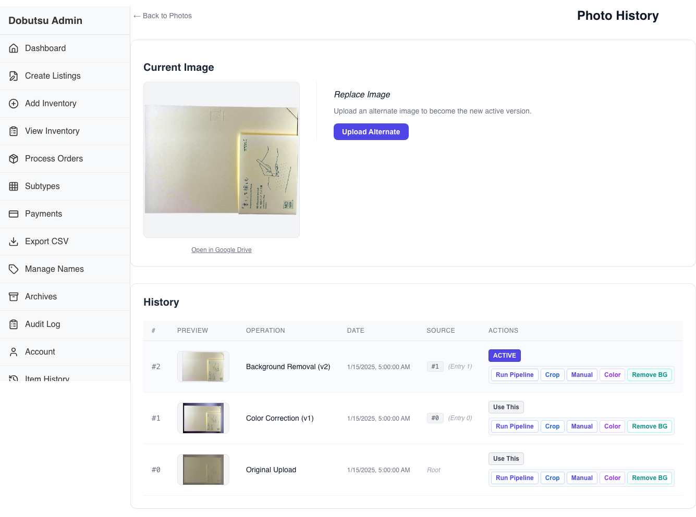

# Photo Processing (Color, Remove BG)

**As a** admin user, **I want to** process product photos (Color Correct, Remove Background) **so that** they are ready for listing.

### 1. Photos View Loaded

**Programmatic Verification:**
- [ ] At least 1 real photo is visible in Photos view
- [ ] Chosen photo is ready for processing
- [ ] Chosen photo thumbnail has fully loaded

### 2. Color In Progress

**Programmatic Verification:**
- [ ] Color operation entered in-progress state
- [ ] Current/history images are fully loaded during in-progress state

### 3. Color Completed

**Programmatic Verification:**
- [ ] Color added one new history version

### 4. Remove BG In Progress

**Programmatic Verification:**
- [ ] Remove BG operation entered in-progress state
- [ ] Current/history images are fully loaded during in-progress state

### 5. Remove BG Completed

**Programmatic Verification:**
- [ ] Remove BG added one new history version

### 6. Processed Photo History

**Programmatic Verification:**
- [ ] History contains expected versions after processing
- [ ] Current image is visible after processing

