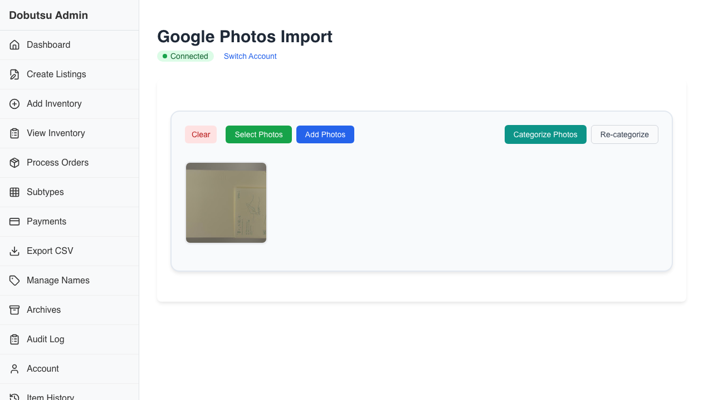
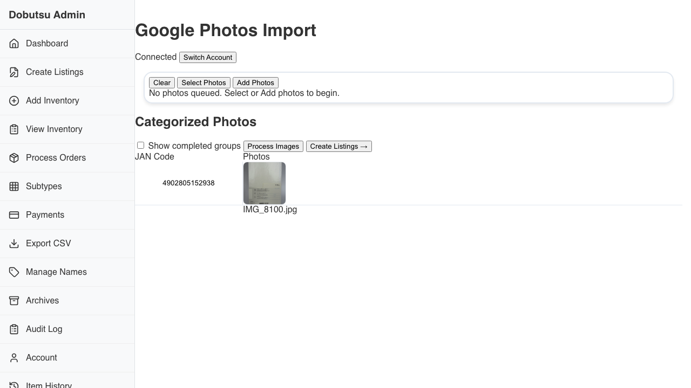

# Live Journey (Photos Categorization)

**As a** catalog operator, **I want to** categorize incoming photos from real connected services **so that** listing creation starts from correctly grouped images.

### 1. Initial Photos State

**Programmatic Verification:**

- [ ] Photos page is visible and interactive
- [ ] Selection controls are visible

### 2. Post Categorization State

**Programmatic Verification:**

- [ ] Categorization run completed (button enabled if present)
- [ ] Post-categorization view keeps photos visible (queue or grouped)
- [ ] Chosen imported image remains fully loaded (not Loading...)
